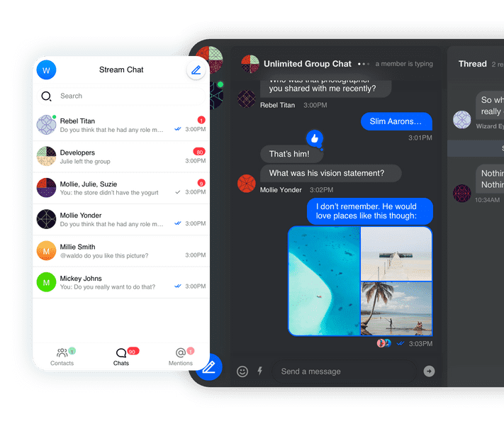

# FamilySocial App

## Application Definition Statement

A blog-style social media application. Why is another blog-style social media application needed if you already have the likes of Facebook, Twitter, and more? Because, what sets the **FamilySocial** application
apart from the others is it is only accessible to a user's family member inner circle. Why is this relevant and of importance enough to create an another additional social media app to enter into an already crowded social media space? Because, creating an application that limits a user's social networking capabilities strictly to the family inner circle as form of social communication both promotes a more intimate severely less judgemental environment to speak your mind amongst loving family members and when judgement occurs, it'll be handled with the intent that facilitates growth from the criticism.
## Target Market

All families. This market has a ceiling of the entire world because everyone has families.

## User Profile

Since the users of this app can virtually be any person in the world. This application can provide service to anyone. I have chosen to display an image of a family. Families are the root users of this app. It is is fitting that a family is to be represented as the user profile.

**Parents:**   *Bob and Jen Smith*

**Age:**   *In their mid thirties (35)+*

**Children:**   *Son (Josh) is eight (8),* *Daughter (Lea) is six (6)*

**Occupations:**   *Dad is in sales,* *Mom is a RN*

**Demographics:**   *The Smiths are a typical middle class family*

**Technologies Used:**   *Both Bob and Jen use their mobile devices to connect to the internet, cloud, and email. Bob uses a laptop for work purposes.*

## Use Cases

The only members of the Smith family that would make use of the **FamilySocial** application would be Bob and Jen.

There would be plenty of use cases for the application. Several examples of these particular use cases:

*  **Blog Posts**
*  **Event Coordination**
*  **Chat**
*  **Family matters**

 

## Problem Statement

The need for **FamilySocial** came about through countless of complaints of online trolling, bullying, and credibility bashing occurring on the known larger social media web apps. Furthermore, it is of strong belief that creating a more intimate family-oriented social media web application will drastically reduce suicides as a result of online bullying. If a **FamilySocial** user is engaging in social interaction amongst fellow family members, it will be a more overall tame positive experience for all with a strong support system.

## Pain Points

As mentioned before, **FamilySocial** application will for the most part alleviate online bullying, bashing, and trolling.

## Solution Statement

Again, as mentioned above, the solution for **FamilySocial** is allowing only family members to access each others pages, and in turn create family communal pages similar to Pinterest but more for image collages and more.
## Competition

At present time, the only competitors to the **FamilySocial** app are the likes of Facebook, Twitter, and similar other social media web apps.

## Key Features

The key features that addresses the problem that **FamilySocial** solves is more of the secluded nature of "keeping it in the family". Having that family inner circle approach which limits users is the very key feature that protects against online bullying to occur.

## Integrations

The only known 3rd party API **FamilySocial** will utilize is the chat feature in which is provided by
Stream.io.

## References

**Smith Family Image -**

Happy Family In Garden [A family of four having fun]. (n.d.). Retrieved from https://depositphotos.com/stock-photos/happy-family.html?qview=59876915

**Stream.io Image -**

Image of The Stream.io App [Visual representation of the Stream.io App]. (n.d.). Retrieved from https://getstream.io/static/6df1716e121b544f0286d81d02fb882f/67872/art.png
